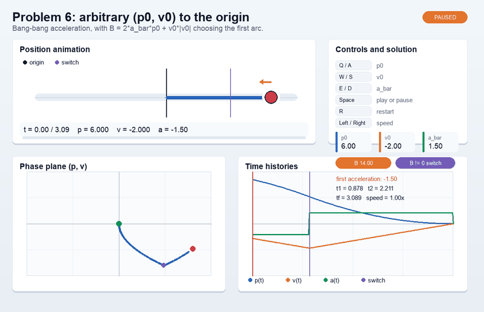

# Seminar 1. Bang-Bang Time-Optimal Control for the Double Integrator



## Introduction

In many control problems, the input cannot be arbitrarily large: motors, drives, brakes, and thrusters all have physical limits. Because of this, a natural question is:

> How should we use the available control in the most efficient way?

One of the most classical formulations is the **minimum-time problem**: transfer the system from a given initial state to a desired terminal state as fast as possible under bounded control.

A typical answer is **bang-bang control**: apply the maximum admissible control, then switch it at the right moment. In real life, this corresponds to ideas such as:
- accelerate as hard as possible, then brake as hard as possible;
- drive an actuator at saturation, then reverse it to stop exactly at the target;
- use full available thrust, then switch to full opposite thrust.

This seminar studies such solutions for the one-dimensional double integrator.

---

## Model

The main system is
$$
\dot p = v, \qquad \dot v = a, \qquad |a| \le \bar a,
$$
where:
- $p$ is the position,
- $v$ is the velocity,
- $a$ is the control input,
- $\bar a > 0$ is the maximum admissible acceleration.

In the first two problems, we also consider the reduced model
$$
\dot p = a, \qquad |a| \le \bar a.
$$

---

## Why bang-bang control appears

The theoretical background is **Pontryagin's Maximum Principle (PMP)**. Its main message for this seminar is simple:

> if the control is bounded and enters the dynamics linearly, then in a time-optimal problem the optimal control usually takes extreme values.

So instead of searching over all possible admissible controls, we are led to expect controls of the form
$$
a(t) \in \{-\bar a,\bar a\}.
$$

That is exactly the bang-bang structure.

For the problems considered here, the optimal control has either:
- no switching, or
- one switching.

---

## How we will solve the problems

In this seminar, we use the following strategy:

1. assume the optimal control is bang-bang;
2. write the trajectory on each time interval;
3. impose the terminal conditions;
4. find the switching time;
5. interpret the result on the phase plane.

So PMP gives the qualitative structure, and the rest is obtained by direct computation.

---

## Phase-plane viewpoint

For the double integrator, it is convenient to work on the phase plane with coordinates
$$
(p,v).
$$

There, the main object is the **switching curve**: the set of states at which the optimal control changes sign.

In this seminar, the switching curve is obtained from a simple idea:

> take the states from which immediate braking reaches the target exactly.

This gives both an explicit formula and a geometric interpretation of the optimal synthesis.

---

## What this seminar covers

We start with the simplest position-only transfers, then solve transfers to the origin and to arbitrary terminal states, and finally pass to the phase-plane formulation.

So the seminar moves from:
- direct one-dimensional formulas,
to
- bang-bang trajectories with switching,
to
- geometric feedback laws on the phase plane.

---

## Main takeaway

The key idea of the seminar is:

> bounded control + minimum time $\;\Rightarrow\;$ extremal control + switching.

The double integrator is the standard model where this idea can be seen completely and explicitly.

---

## Pygame animation for Arbitrary Initial Position and Velocity, Transfer to Zero

This repository includes a small interactive Pygame project for Arbitrary Initial Position and Velocity, Transfer to Zero.

### Theory

We consider the double integrator
$$
\dot p = v, \qquad \dot v = a, \qquad |a| \le \bar a,
$$
with initial conditions
$$
p(0)=p_0, \qquad v(0)=v_0,
$$
and terminal conditions
$$
p(t_f)=0, \qquad v(t_f)=0.
$$

The useful comparison motion is immediate braking against the initial velocity:
$$
a(t)=-\bar a\,\operatorname{sgn}(v_0).
$$

If this control is applied until the velocity becomes zero, then
$$
t_{\mathrm{stop}}=\frac{|v_0|}{\bar a},
$$
and the stopping position is
$$
p_{\mathrm{stop}}
=p_0+\frac{v_0|v_0|}{2\bar a}.
$$

Introduce
$$
B = 2\bar a\,p_0 + v_0|v_0|.
$$
Since
$$
B = 2\bar a\,p_{\mathrm{stop}},
$$
the sign of `B` tells us on which side of the origin the system would stop under immediate braking.

If
$$
B=0,
$$
then immediate braking reaches the origin exactly, so
$$
a^*(t)=-\bar a\,\operatorname{sgn}(v_0),
\qquad 0\le t\le t_f,
$$
with
$$
t_f=\frac{|v_0|}{\bar a}.
$$

If
$$
B\neq 0,
$$
the optimal control has one switching. Define
$$
j=-\operatorname{sgn}(B).
$$
Then
$$
a^*(t)=
\begin{cases}
j\bar a, & 0\le t<t_1,\\
-j\bar a, & t_1\le t\le t_f.
\end{cases}
$$

Writing
$$
t_f=t_1+t_2,
$$
the switching durations are
$$
t_2=\sqrt{\frac{v_0^2-2j\bar a\,p_0}{2\bar a^2}},
$$
$$
t_1=t_2-\frac{jv_0}{\bar a},
$$
and
$$
t_f=t_1+t_2.
$$

Thus:
- if `B > 0`, the first acceleration is negative;
- if `B < 0`, the first acceleration is positive;
- if `B = 0`, no switching is needed.

### Run the animation

```bash
python -m venv .venv
source .venv/bin/activate
pip install -r requirements.txt
python main.py
```

The animation shows:
- the one-dimensional motion toward the origin;
- the phase-plane path $(p,v)$;
- the time histories of $p(t)$, $v(t)$, and $a(t)$;
- the sign of
  $$
  B = 2\bar a p_0 + v_0|v_0|
  $$
  and the corresponding first acceleration arc.

Keyboard controls:
- `Q` / `A`: increase / decrease `p0`;
- `W` / `S`: increase / decrease `v0`;
- `E` / `D`: increase / decrease `a_bar`;
- `Space`: pause or resume;
- `R`: restart the current trajectory;
- `Left` / `Right`: change animation speed;
- `Esc`: quit.

The solver logic is in `problem6_pygame/solver.py`, and the Pygame visualization is in `problem6_pygame/app.py`.

To regenerate the README animation preview:

```bash
python tools/export_readme_animation.py
```

## AI usage note

This Pygame animation project was created with assistance from OpenAI Codex. AI assistance was used to scaffold the project structure, implement the interactive visualization, add tests, and update documentation. The mathematical solution follows the derivation in `solutions/task_6.md`.
